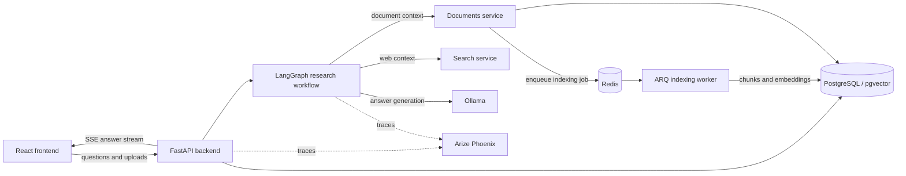

# Research Agent

A local research assistant that combines user-provided documents with live web sources and streams the answer as it is
generated

## Contents

- [Features](#features)
- [How It Works](#how-it-works)
- [Technology Stack](#technology-stack)
- [Requirements](#requirements)
- [Setup](#setup)
- [Configuration](#configuration)
- [Example Questions](#example-questions)
- [Evaluation](#evaluation)
- [Design Notes & Trade-offs](#design-notes--trade-offs)
- [Known Limitations](#known-limitations)
- [Possible Next Steps](#possible-next-steps)

---

## Features

- Streams generated research answers over Server-Sent Events
- Streams agent workflow events, node timings, and answer chunks to the frontend
- Grounds answers in uploaded PDF, DOCX, PPTX, XLSX, HTML, Markdown, CSV, and image sources
- Searches the web and extracts readable page content
- Keeps document and web evidence separate in the retrieved context
- Uses recent conversation history for follow-up requests
- Indexes uploaded files asynchronously in a background worker
- Exposes LangChain and agent traces in Phoenix
- Runs chat and embedding models locally through Ollama

---

## How It Works



The backend selects the route first, then chooses document context, web context, or both. When both sources are
required, retrieval runs in parallel. The final answer is generated from the retrieved chunks and streamed back to the
client

---

## Technology Stack

| Area      | Technology                                     |
|-----------|------------------------------------------------|
| Frontend  | React, TypeScript, Vite, Nginx                 |
| API       | FastAPI, Uvicorn, SSE                          |
| Agent     | LangGraph, LangChain, Ollama                   |
| Documents | Docling, background ARQ worker                 |
| Search    | DuckDuckGo search, Trafilatura page extraction |
| Storage   | PostgreSQL with pgvector                       |
| Queue     | Redis                                          |
| Tracing   | Arize Phoenix                                  |
| Runtime   | Docker Compose                                 |

---

## Requirements

- Docker with Docker Compose
- NVIDIA Container Toolkit and a compatible GPU for the default Ollama setup
- Enough memory and disk space for the configured LLM, embedding model, and document conversion dependencies

---

## Setup

1. Copy or rename `.env.example` to `.env`:

   ```bash
   cp .env.example .env
   ```

2. Start all services:

   ```bash
   docker compose up --build
   ```

   On the first run, Compose initializes the database, starts the worker, and pulls the configured Ollama models. This
   can take several minutes

Open the services at:

- Frontend: <http://localhost:5173>
- API docs: <http://localhost:8000/docs>
- Phoenix tracing: <http://localhost:6006>

---

## Configuration

The most relevant variables are:

- `LLM_MODEL` — Ollama model used for routing, retrieval decisions, and answer generation
- `EMBEDDING_MODEL` — Ollama model used to index and search document chunks
- `EMBEDDING_DIMENSIONS` — vector size produced by the embedding model
- `DOCUMENTS_MAX_UPLOAD_BYTES` — maximum size of one uploaded file
- `DOCUMENTS_FORMATS` — formats accepted by the upload flow
- `API_BASE_URL` — backend URL embedded into the production frontend
- `CORS_ORIGINS` — browser origins accepted by the backend
- `POSTGRES_*` and `REDIS_*` — storage and queue connection settings

The default upload configuration supports `pdf`, `docx`, `pptx`, `xlsx`, `html`, `md`, `csv`, and images

---

## Example Questions

| Question                                                      | Scenario                                       |
|---------------------------------------------------------------|------------------------------------------------|
| `What are the main risks described in the available sources?` | General research request                       |
| `Summarize the key findings and cite the sources`             | Summary and source attribution request         |
| `What is the latest information about this topic?`            | Web-oriented research request                  |
| `Can you explain the previous answer in more detail?`         | Follow-up request within the same conversation |
| `Write python script to sum two numbers`                      | Bare-topic routing case                        |

---

## Evaluation

The initial evaluation approach used LangSmith tracing. It was later replaced with local Arize Phoenix tracing to keep
observability self-hosted and easier to run with the rest of the stack.

Because of the time limit, no automated test suite was added. Behavior was checked through traced runs, with attention
to routing, retrieval, streaming, latency, and failure paths. A production version should add a fixed, versioned dataset
covering document-only, web-only, mixed-source, follow-up, ambiguous, unsupported, and failure cases.

Measure:

- retrieval relevance and source coverage;
- factual correctness and citation accuracy;
- unsupported-claim and hallucination rate;
- routing and clarification accuracy;
- first-token latency and total generation time;
- indexing success and time until a source is searchable;
- API and dependency failure rates.нк 

Automated checks are useful for retrieval and citation coverage. Final answer quality should also be reviewed by humans
against a reference answer or a clear scoring rubric. Phoenix traces help identify whether a poor result came from
routing, retrieval, prompting, model generation, or infrastructure.

---

## Design Notes & Trade-offs

The workflow is intentionally self-contained instead of relying on hosted research or LLM APIs. Routing, retrieval,
streaming, and failure handling stay explicit, while the models run locally through Ollama. Agent streaming was added
so the frontend can receive workflow progress and answer chunks while the request is running.

Only actionable failures are exposed to the user. Non-critical LLM and dependency errors are kept in logs and traces. If
one context source fails, the request can continue with the remaining context. Critical failures return a generic
service error.

---

## Known Limitations

- Documents and chat history are scoped to the conversation UUID created when the frontend page is opened. A refresh or
  new tab starts a new conversation
- The frontend receives workflow events but does not yet display routing, research, and answer-generation status
- No document indexing status in the UI
- No dedicated temporary blob storage for uploads
- The current document-processing stack is heavy and may be overkill for a local setup. The library choice is not final and would benefit from another review, since I have not built a local document-processing pipeline recently
- The configured local model is relatively small and can hallucinate or confuse dates. Source-grounding and an
  authoritative current-date instruction were added to the prompts, but the issue is not fully eliminated
- Deployment is configured for local development rather than production operations
- No automated tests were added within the task time limit

---

## Possible Next Steps

- Display routing, research, and answer-generation status in the frontend using the existing stream events
- Add a reranker after retrieval. Ollama has no suitable reranker interface, and integrating a separate Hugging Face
  model was outside the available time
- Combine semantic vector search with lexical search for exact names, keywords, and identifiers
- Expose upload and indexing status in the frontend
- Add reproducible evaluation runs and regression datasets
- Add production monitoring, rate limits, and stronger dependency failure handling

---

[Back to top](#research-agent)
